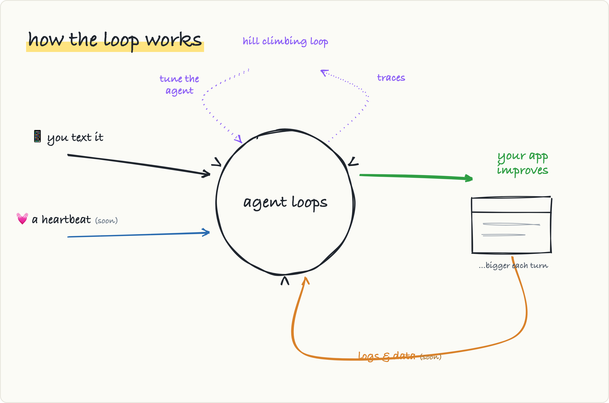

<div align="center">

# Little Living Apps

### Software you can just talk to.

Text it into being. Text it as it grows.

<a href="docs/hero.mp4"></a>

**One agent. One app. One host.**

You text; an agent builds a real app, ships it, then lives on the same box maintaining it as it grows.

Welcome to the personal software era.

[](https://github.com/zakkl13/little-living-apps/actions/workflows/ci.yml)
[](#evals)
[](#evals)
[](#adopt-it-fork-it-run-it-on-a-box-you-own)
[](#license)

</div>

---

## What this is

**Little Living Apps is an agent that builds your app from plain text, then never leaves.** You text a
manager on Telegram; it builds, ships, and then *keeps maintaining* a real web or mobile app for you,
indefinitely.

The framework deals in **apps and functionality, not code**. You say what the app should *do*
("build me a reading log", "add tags by genre", "filter the list") and the agents own every line,
every deploy, and every change after that. You never open an editor. You never read a diff.

"Living" is the point. A builder hands you code and moves on; this stays and owns the upkeep. The
agent doesn't generate and leave. It keeps planning, remembering, and shipping against the *same*
app, so next week's "add a chart" lands in the same place this week's reading log did.

The whole thing is small enough to keep in your head: **one agent, one app, one host you own.** It
runs over a Telegram long-poll. No open ports, no public URL, no cloud bill from us, because there
is no us. You bring the host, the bot, and your existing ChatGPT or Claude subscription. That's the
dependency list.

### Status

Little Living Apps is in early beta: the framework is moving quickly, and setup details may still
change. It is usable today, already powers [lillivinapps.zakk.io](https://lillivinapps.zakk.io),
and is being actively dogfooded across many other personal software ideas.

The supported production install target today is Docker Compose on a fresh Linux VPS: one Compose
project per living app.

### The personal software era

The personal computer made the machine yours. The software on it didn't follow; it stayed
mass-market, written for millions, and you bend to fit it.

Agents change the economics. Software is finally worth building
for one person. Not a SaaS you rent and mold yourself to, but an app shaped to exactly how you think,
with an audience of one: you.

That's the era this is built for. You describe what you want, and an agent builds it and keeps it
alive on a box you own. The PC made computers personal. This makes software personal.

## Quick start

You will need
* a ChatGPT or Claude subscription
* a VPS to run your app-agent on
* a new telegram bot

### Let an agent set it up for you

The fastest path is to hand the whole setup to Claude Code or Codex. Point it at this repo and ask:

> **go check out the GitHub repo zakkl13/little-living-apps and set up an app instance for me**

The agent drives the rest end to end: VPS sizing, SSH, Docker, the Telegram bot, `.env`, the
one-time subscription login, and an optional domain with HTTPS. It only pauses for the handful of
secrets it can't invent.

> **Doing this more than once?** For repeatable setups and adding new instances, install the
> `setup-living-app` skill once (`npx skills add zakkl13/little-living-apps -a claude-code -a codex -g`),
> then run `/setup-living-app` (Claude Code) or `$setup-living-app` (Codex).

### Or do it by hand

```bash
git clone https://github.com/zakkl13/little-living-apps.git && cd little-living-apps
cp .env.example .env && $EDITOR .env     # set TELEGRAM_BOT_TOKEN + ALLOWED_USER_IDS
bin/new-instance primary                  # build image, create volumes, start the Compose project

# one-time: log the box into your ChatGPT subscription (Codex backend)
docker compose --env-file .docker/primary.env exec manager codex login --device-auth
docker compose --env-file .docker/primary.env restart manager

docker compose --env-file .docker/primary.env logs -f manager
```

`bin/new-instance` writes `.docker/<instance>.env`, creates instance-prefixed named volumes,
and starts one Compose project. If `LILA_DOMAIN` is set, it enables the bundled Caddy profile for
HTTPS automatically. The app container runs `lila-new-app` before serving, so a fresh workspace is
scaffolded automatically and later restarts keep the same persistent volume.

### Slash commands

Now message your bot. Anything you send that isn't a command goes to the manager; it delegates,
builds, and reports back. The control commands:

| Send | Does |
|---|---|
| *anything* | the manager handles it: delegates, builds, reports back |
| `/help` | the command list (also `/start`) |
| `/status` | active workers, pending events, backend, and memory path |
| `/new` | fresh manager thread (long-term memory is kept) |
| `/backend [codex \| claude]` | show or hot-swap the agent backend (restarts; memory kept) |

### More than one app

The model is always *one manager, one app*. Want more apps on a single host? Run it more than once.
Each instance gets its own manager, Telegram bot, workspace, ports, and domain:

```bash
LILA_DOMAIN=cm.example.com APP_PORT=3001 INSPECTOR_PORT=9091 \
     TELEGRAM_BOT_TOKEN=<new-bot-token> \
     bin/new-instance cm
```

Every instance, the first one (`primary`) and every addition, runs as its own Compose project with
its own manager, app container, workspace, memory, state, Codex home, ports, and bot. Create one bot
per instance via @BotFather; a bot can't be long-polled twice.

## Security

> **The host is the boundary. Run this on a disposable box you'd hand an agent: a fresh VM, never
> your laptop.**

That one sentence is the whole security model, and it's a *feature*: there's nothing subtle to
get wrong.

- **The host is the boundary.** Workers run with `danger-full-access` and never pause for approval;
  the manager hands them the whole box. So the box has to be one you're fine handing over: a throwaway
  VM, not a machine with anyone else's data on it.
- **Single owner.** Only the Telegram user IDs in `ALLOWED_USER_IDS` reach the model. Everyone else
  gets a refusal at the door.
- **Private until you publish.** The outbound long-poll means nothing on the box is reachable from the
  internet, not until you deliberately point a domain at the app the agents built.
- **It won't spend your money behind your back.** The bot rides your subscription, not metered API
  billing. It *refuses to start* if the active backend's pay-per-token key is set; that guard is the
  last line between you and a surprise invoice.

## How it works

Little Living Apps runs as a **flywheel**. Every turn ships a change *and* deepens memory, so the
next turn starts smarter.

<div align="center">
  
</div>

One manager takes **one turn at a time** off a single event queue. A trigger arrives (today that's
you texting it; on the roadmap, a heartbeat tick) and the turn walks three beats:

1. **Plan.** The manager reasons over long-term memory and decides what to do. **It has no hands:**
   it runs in a read-only sandbox with shell and network *off*, and can't touch the box directly. Its
   only tools are a handful served over loopback (`memory_*` and `subagent_start`). It thinks; it
   doesn't reach. A plain message *is* the reply; `NO_REPLY` lets it stay silent on noise.
2. **Build.** `subagent_start` spins up **ephemeral workers** (in parallel when the work is parallel).
   Each one does the concrete work with real shell, real git, real files, **validates before claiming
   "done,"** ships to the box, and is **gone** after one objective. No roster, no resume.
3. **Remember.** What matters gets written to a git-backed memory repo and reported back as a
   `worker_event`, which re-enters the queue and can drive the next turn.

Two properties keep the wheel turning:

- **Continuity lives in the world, not in agent state.** Everything that matters is the workspace, its
  git history, and the memory repo, so nothing depends on a worker staying alive. The whole system is
  **restart-lossless**: the manager thread, event queue, and memory all survive a reboot and pick up
  mid-thought.
- **Memory is the flywheel's mass.** It accumulates across turns, so each cycle makes the next one
  better. That's the outer, compounding loop; loop-engineering calls it *hill-climbing*.

### Two feedback loops close the flywheel

The turn above is the inner loop. What makes the app *living* is that its own behavior comes back
around. On the roadmap (see `ROADMAP.md`), two outer loops feed it:

- **The app feeds the agent.** The running app emits **logs and data** about how it actually behaves
  in production, and that flows back into the loop as another trigger. So the agent can catch a slow
  path or a regression and fix it before you complain. The app improves the app.
- **Traces tune the agent.** This one is separate from the product loop above. It watches the
  **agent's own traces** (what it did, where it went wrong) and feeds that back to improve the *agent
  itself*, not the app. It's the dotted loop in the sketch: a meta layer that grades behavior over
  time and adjusts how the agent works. In loop-engineering terms it's the **hill-climbing loop**;
  each pass makes every future turn a little better.

## Tech involved

Every choice here bought something and cost something. Both sides, for each:

### Codex or Claude: the agent backend

The manager brain and the workers both run on a subscription-billed backend, selected by
`AGENT_BACKEND` (default `codex`). Both ride a subscription, not metered API billing, behind the
same internal seams.

The Docker image includes both `codex` and `claude`, so a later `/backend codex|claude` swap does
not depend on which backend was active when the instance was created.

| | `codex` (default) | `claude` |
|---|---|---|
| Driver | `lila-codex` (vendored fork of `codex-client-sdk`, Rust) → `codex` CLI | `claude-agent-sdk-rust` → `claude` CLI |
| Subscription | ChatGPT | Claude Pro/Max |
| One-time host auth | `codex login --device-auth` | `claude setup-token`, then save the printed token as `CLAUDE_CODE_OAUTH_TOKEN` |
| Pay-per-token key (must be **unset**) | `OPENAI_API_KEY` / `CODEX_API_KEY` | `ANTHROPIC_API_KEY` |

*Why:* these are the two frontier coding agents you can drive off a flat-rate consumer subscription
instead of metered API billing, so the running cost is a plan you already pay for, not a meter
ticking while agents work. **I recommend Codex (the default).** A ChatGPT subscription comes with a
far more generous token allocation than a Claude plan, so Codex is the backend least likely to hit a
ceiling mid-build. Claude adapts sharply and is a great choice, but its plan's lower token allocation bites first
when the workers get busy. Keeping both behind one seam means you can **swap on a live instance** with
`/backend claude` (or `/backend codex`); it persists the choice and restarts clean, losing no memory.
*Cost:* a ToS caveat on the Claude backend (below), and you watch concurrency if you run many
instances on one account.


### Telegram: the interface

The owner talks to the manager over a Telegram bot, polled outbound with `getUpdates`.

*Why:* it buys **zero infra**: no inbound port, no public URL, no TLS to manage; the bot runs behind
NAT or on a home box, and it's a chat UI everyone already has on every device. The outbound long-poll
is also what keeps the box private by default; nothing is reachable from the internet until you
publish. *Cost:* it's a chat, not a rich dashboard. (For watching the *agent system* itself, there's
a local Inspector.)

### The app stack: Rails 8 + PWA by default, pluggable

Ask for an app and a worker scaffolds it with `lila-new-app`: a minimal **Rails 8 + PWA** project,
SQLite on the Solid stack, Hotwire, Rails' built-in auth, running in **reload mode** so edits go
live on the next request. In Docker, the app container runs `lila-new-app` before the stack's serve
command, so the workspace volume starts empty and becomes the app. The app binds inside the Compose
network and is published only through the host port or optional Caddy profile.

*Why:* Rails 8 is batteries-included (auth, DB, and a PWA on day one) and reload mode means edits go
live without a deploy step, which is exactly the loop a maintaining agent needs. The substrate is
kept deliberately thin, Rails defaults plus PWA and auth, so the agents build *on top of* a sane
baseline instead of fighting a heavy template. *Cost:* it's opinionated; you're building in Rails.

**The stack is a plugin.** Each one lives in `stacks/<name>/`: a `stack.toml` plus a scaffold script
and two prompt fragments. You pick one per instance with `LILA_STACK` (default `rails-pwa`). To build
a different *kind* of app (another framework, language, or even a non-web target), drop in a new
directory. No Rust changes, no recompile. Rails 8 + PWA ships as the batteries-included default;
`node-react` (a zero-build Node + React PWA) ships alongside it. See [`stacks/README.md`](stacks/README.md)
to add your own.

**A safe design system, picked for you, and yours to change.** Each instance starts on a real, coherent
design system drawn from a **vendored catalog of [Open Design](https://github.com/nexu-io/open-design)
systems** (`design/systems/`, Apache-2.0, see [`design/systems/PROVENANCE`](design/systems/PROVENANCE)).
Each system's curated package (machine-readable `tokens.css` plus reference components) is installed at
standup and adapted into the app, so it builds on a real design baseline instead of raw AI slop.
lila ships no design code of its own; it uses Open Design's curated assets directly. The framework only
ever draws *blindly* from a tiny pool of safe neutrals, so no fresh app can land on a catastrophic look.
After the first screen ships, the agent offers (once) to pick a different look, and you can change it
anytime ("make it warmer", "something like Stripe"). Pin one outright with `LILA_DESIGN=<brand>` (any of
the 150 systems) or `random` (the default). lila imposes no taste of its own; it picks something safe
and hands you the wheel. The look is locked per app and won't reroll on its own. Stacks opt in with a
`[design]` block; "looks designed" is then a *measured* gate like every other (the `looks_designed` eval
grader plus the selection-flow scenarios).

### Rust: the orchestrator

The manager loop, event queue, MCP tools, worker runner, and the durability layer that holds it all
together are written in idiomatic async **Rust**: one self-contained binary per host instance
(`lila`), driving the `codex`/`claude` CLIs over their JSON event protocols.

*Why:* the orchestrator is the part that must never lose a message, double-reply, or corrupt memory,
so it's built for exactly that: a single serialized loop, no global mutable state, no `unsafe`, and
every external boundary an injectable seam, which is what lets the deterministic suite (below) drive
the *real compiled binary* against fakes. CI denies clippy warnings and caps cyclomatic complexity at
6 per function. It ships as one binary inside the Docker image; the app language runtime lives beside
it because workers need the same environment they deploy into.
*Cost:* a two-language system, Rust for the brain and whatever the chosen stack uses for the apps
(Ruby/Rails by default); and the image build compiles that binary from source rather than installing
a prebuilt package.

## Tests & Evals

There are two layers of verification, because agents have a deterministic half and a judgment half:

- **`cargo test`** covers everything deterministic. Every external boundary (the agent backends,
  Telegram, the worker runner) is an injectable seam, so the **real** compiled binary (queue, memory,
  MCP tools, orchestrator, durability) runs against fakes while git and sqlite memory run for real. The
  headline e2e spawns `lila run` against a fake Telegram server and fake agent CLIs and drives a full
  owner-message → workers → memory-write → reply cascade, then proves a `SIGTERM` cold restart loses
  nothing. Coverage on this **logic core sits at ~80%** (queue 94%, snapshot 95%, telemetry 93%,
  orchestrator 88%, memory FTS 91%), and because the binary-driven tests run the spawned daemon
  under coverage, the `lila run` loop itself (manager app, command dispatch, the pollers) counts too.
  The badge excludes only the real-subscription seams, which by design run against a real account: the
  `codex`/`claude` manager and worker backends and the `lila eval` harness (the `#[ignore]`d `live_*`
  tests).

- **`lila-eval`** measures what tests can't: how the **real** manager and **real** workers
  behave. A trial boots the full production system (real model, real workers, real shell in a real
  workspace) with one substitution: Telegram deliveries are captured for grading instead of sent. It
  grades **outcomes and order, never tool paths**: did the work actually run, did the agent validate
  before claiming done, did it stay quiet on noise, did it remember. Agents that find a smarter route
  still pass. On the current smoke set (`delegate-and-report`, `remember-fact`, `recall-fact`),
  **Codex scores a mean 1.00 (3/3) and Claude 0.95**; Claude shaves points only on the no-shop-talk
  discipline check, not on the work itself. These are single-trial smoke numbers; the real signal is
  pass^k over more trials, so treat them as a pulse, not a leaderboard.

```bash
cargo test                                      # deterministic suite (compiled binary, faked boundaries)
cargo clippy --all-targets -- -D warnings       # lints (CI denies warnings)
cargo run --release --bin lila-eval -- --smoke  # cheapest live pulse against the real model
```

For a full live baseline, bank results first and bless them after the token-spending runs are done.
Every completed trial is written immediately, and repeated runs can share one `--out-dir` without
clobbering each other:

```bash
RUN=eval/results/baseline-codex
cargo run --release --bin lila-eval -- --axis delegation --out-dir "$RUN"
cargo run --release --bin lila-eval -- --axis validation --out-dir "$RUN"
cargo run --release --bin lila-eval -- --axis memory --out-dir "$RUN"
cargo run --release --bin lila-eval -- --from-results "$RUN" --update-baseline
```

Use `--filter`, `--axis`, or `--smoke` for whatever chunks fit under the current usage limit. The
`--from-results` pass re-aggregates saved per-trial JSON without spending model tokens, so it also
works if an earlier run was interrupted before writing its aggregate report.

## Roadmap

The system is host-native and runnable today. The manager runs on a plain VM over long-poll; the app it builds is a
**pluggable stack** (Rails 8 + PWA by default, `node-react` alongside it, and any directory you drop
into `stacks/`). On the roadmap: more first-class stacks beyond the default, and giving the apps
first-class self-observability, so the team can watch and maintain against real runtime behavior the
way an engineer leans on an APM dashboard (see `ROADMAP.md`).

## Adopt it. Fork it. Run it on a box you own.

> **Bring your own everything.** This is an open pattern, not a service: your host, your Telegram
> bot, your subscription. Nothing to sign up for, and nothing to pay us.

If the idea of an app with a live-in maintainer appeals to you, the fastest way to get it is to
stand one up. The Quick start is a handful of commands, or you hand the whole thing to an agent with
the `setup-living-app` skill.

## License

MIT.
</content>
</invoke>
